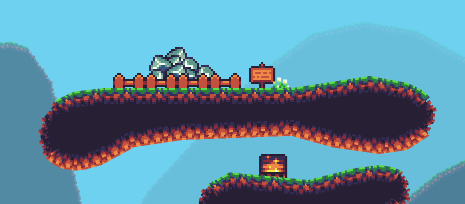

# Bordered Polygon2D for Godot Engine

Add borders to your Polygon2Ds. Useful for creating maps using textures.

## Usage

Create a `BorderedPolygon2D` node and attach either a single border texture or
a TileSet with several border texures. You might need to use options to proper
align/rotate/scale texture.

### Examples

Visit the [examples folder](./examples) to see different examples on how to use
BorderedPolygon2D.

## Options

There are some options available to customize BorderedPolygon2D:

- **Border Size**: The border size in pixels.
- **Border Overlap**: The border overlap in pixels. Specify how many pixels of
    the border should overlap with the inner texture.
- **Border Texture**: A single texture\* for all borders.
- **Border Textures**: Tileset with border textures\*. This is basically a
    collection of sprites. BorderPolygon2D will take the texture inside each
    sprite. If set, "Border Texture" option's value will be ignored. Image order
    is important here, first image should be the north border image and the next
    image should be the right border clockwise, and so on. For example, if you
    have four images, you will need to arrange them as tileset children like this:
    [0:North, 1:East, 2:South, 3:West]
- **Border Clockwise Shift**: Apply clockwise shift to border textures.
- **Border Texture Scale**: Apply scale to all border textures.
- **Border Texture Offset**: Apply offset to all border textures.
- **Border Texture Rotation**: Apply rotation to all border textures.

\*All textures must have same orentation (north) and will be
automatically rotated when inserted into borders.

## Future Work

Want to know what is ahead? Visit the [enhancements list](../../milestone/1)!
